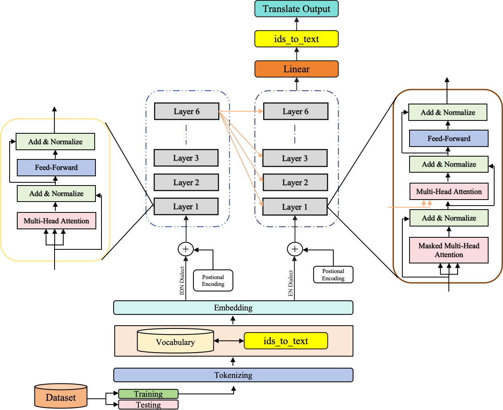

# LinguaIDEN: Transformer-based Neural Machine Translation for Indonesian ↔ English



This repository implements a **Neural Machine Translation (NMT)** model using the Transformer architecture. The model can translate between **Indonesian ↔ English** (or any other language pairs supported by the OPUS dataset).

---

## 📦 1. Download Dataset

We use the [OPUS](https://opus.nlpl.eu/results/en&id/corpus-result-table) dataset for training.  
You can choose **English–Indonesian** or other pairs.

Example: Download the **Tico** or **other** dataset.

```bash
# Download English–Indonesian dataset from OPUS
# Example with wget (replace with your desired dataset URL)
wget -O data/ind-eng.zip "https://object.pouta.csc.fi/OPUS-Tatoeba/v2023-07-18/moses/id-en.txt.zip"

# Extract dataset
unzip data/ind-eng.zip -d data
```

You should end up with files like:
```
en-id.txt
│   ├── LICENSE
│   ├── README
│   ├── tico-19.en-id.en # English Text
│   ├── tico-19.en-id.id # Indonesia Text
│   └── tico-19.en-id.xml
```

---

## ⚙️ 2. Environment Setup

We provide a setup script **`setup_conda.sh`** for installing dependencies.

```bash
chmod +x setup_conda.sh
./setup_conda.sh
```

`setup_conda.sh` will:
- Create a new Conda environment
- Install PyTorch, tokenizers, and other dependencies from `requirements.txt`

If you want to do it manually:
```bash
conda create -n nmt python=3.9 -y
conda activate nmt
pip install -r requirements.txt
```

---

## 🚀 3. Training

Once the dataset is prepared and the environment is active, run:

```bash
python train.py 
```
---

## 💡 4. Inference

To translate a sentence after training:

```bash
python inference.py 
```

Expected output:
```
Input: Saya suka belajar pemrograman.
Output: I like learning programming.
```
---

## ✨ Example Translation (Indonesian → English)
```bash
import torch, json
from model import Transformer

# Load vocabs
src_vocab = json.load(open('src_vocab.json'))
tgt_vocab = json.load(open('tgt_vocab.json'))
id2word = {v:k for k,v in tgt_vocab.items()}

# Load model
model = Transformer(...).to('cpu')
model.load_state_dict(torch.load('best_transformer_model.pt', map_location='cpu'))
model.eval()

# Translate
sentence = "Dia pergi ke sekolah setiap hari."
print("EN:", translate(sentence))

```
```
Input: Dia pergi ke sekolah setiap hari.
Output: He goes to school every day.
```
