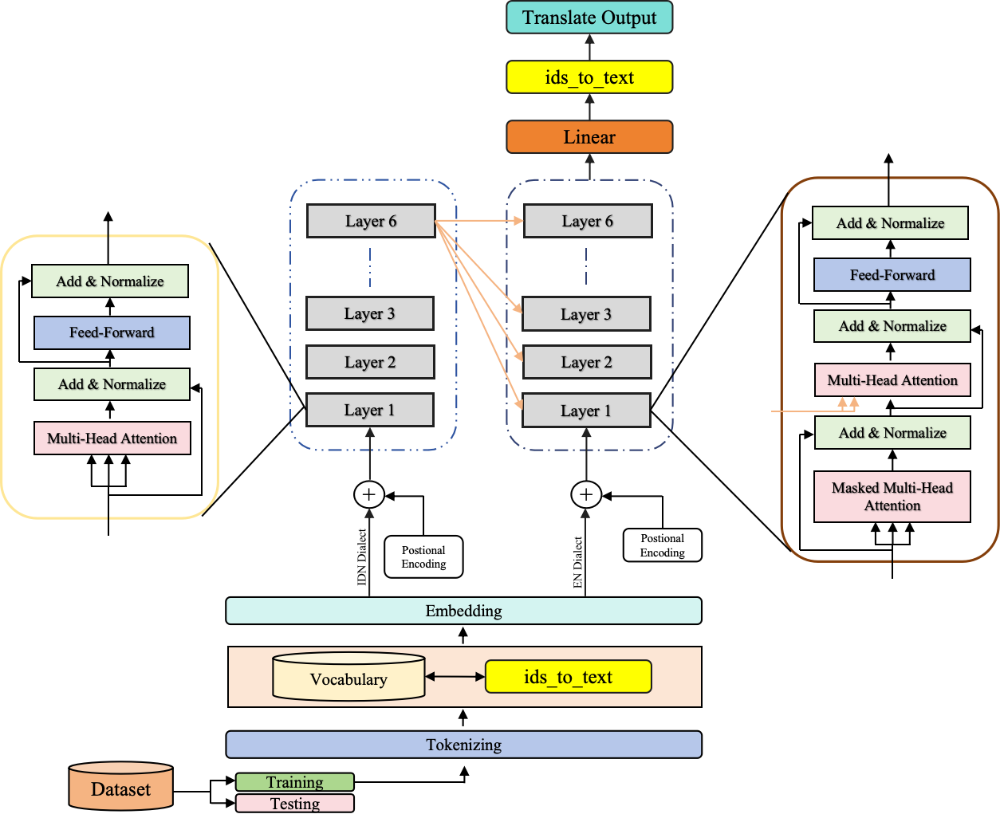

# LinguaIDEN: Transformer-based Neural Machine Translation (Indonesian ↔ English)

[](https://opensource.org/licenses/Apache-2.0)
[](https://www.python.org/)
[](https://mlflow.org/)



**LinguaIDEN** is a **Neural Machine Translation (NMT)** project built with the Transformer architecture. It can translate between **Indonesian ↔ English** and can be adapted for other language pairs supported by the [OPUS](https://opus.nlpl.eu/) dataset.

---

## 📦 1. Download Dataset

We use the [OPUS](https://opus.nlpl.eu/results/en&id=corpus-result-table) dataset for training. You can choose **English–Indonesian** (Tico, Tatoeba, or others) or other language pairs.

Example: Download English–Indonesian dataset:

```bash
wget -O data/ind-eng.zip "https://object.pouta.csc.fi/OPUS-Tatoeba/v2023-07-18/moses/id-en.txt.zip"
unzip data/ind-eng.zip -d data
```

After extraction, you should see:

```
data/
├── LICENSE
├── README
├── tico-19.en-id.en   # English sentences
├── tico-19.en-id.id   # Indonesian sentences
└── tico-19.en-id.xml
```

---

## ⚙️ 2. Environment Setup

We provide a setup script **`setup_conda.sh`** for installing dependencies:

```bash
chmod +x setup_conda.sh
./setup_conda.sh
```

Manual installation:

```bash
conda create -n nmt python=3.9 -y
conda activate nmt
pip install -r requirements.txt
```

---

## 🚀 3. Training

```bash
python train.py
```

---

## 💡 4. Inference

```bash
python inference.py
```

Example output:

```
Input: Saya suka belajar pemrograman.
Output: I like learning programming.
```

---

## ✨ 5. Example Translation (Indonesian → English)

```python
import torch
import json
from model import Transformer

# Load vocabularies
src_vocab = json.load(open('src_vocab.json'))
tgt_vocab = json.load(open('tgt_vocab.json'))
id2word = {v: k for k, v in tgt_vocab.items()}

# Initialize and load model
model = Transformer(
    src_vocab_size=len(src_vocab),
    tgt_vocab_size=len(tgt_vocab),
    # Add other hyperparameters here
).to('cpu')

model.load_state_dict(torch.load('best_transformer_model.pt', map_location='cpu'))
model.eval()

# Example translation function (pseudo)
def translate(sentence, model, src_vocab, tgt_vocab, id2word):
    return "He goes to school every day."

# Translate a sentence
sentence = "Dia pergi ke sekolah setiap hari."
translation = translate(sentence, model, src_vocab, tgt_vocab, id2word)
print("Input:", sentence)
print("Output:", translation)
```

Expected output:

```
Input: Dia pergi ke sekolah setiap hari.
Output: He goes to school every day.
```

---

## 🔗 References

* [Transformer Paper (Vaswani et al., 2017)](https://arxiv.org/abs/1706.03762)
* [OPUS Dataset](https://opus.nlpl.eu/)

---

## 🛠 Contributing

Contributions are welcome! Open an issue or submit a pull request.
